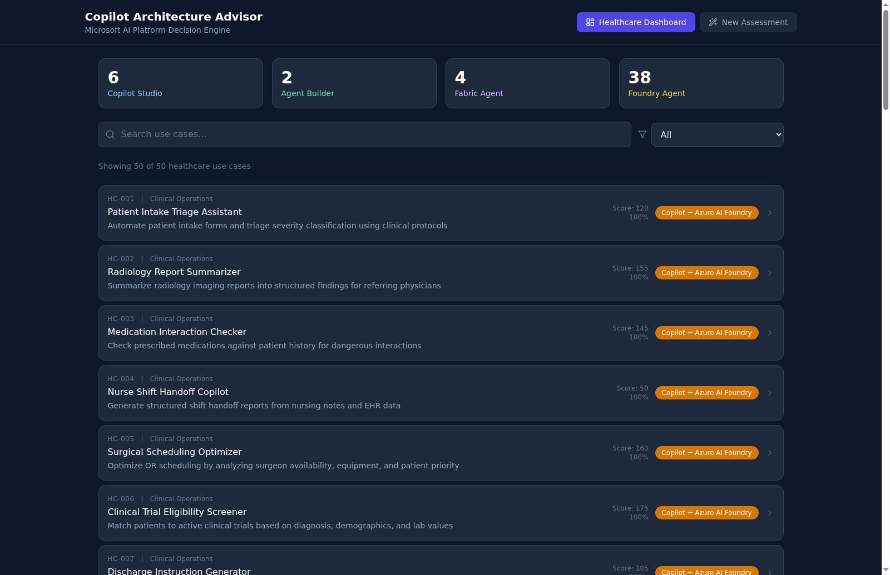
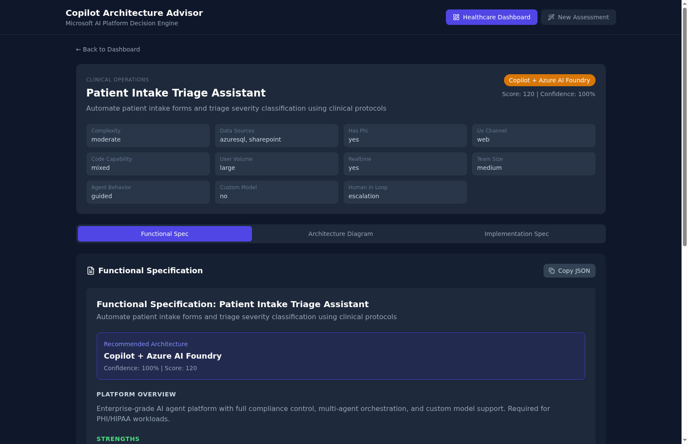
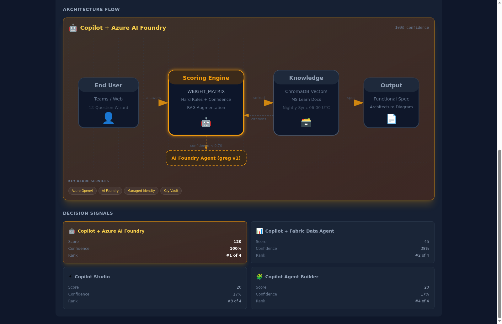
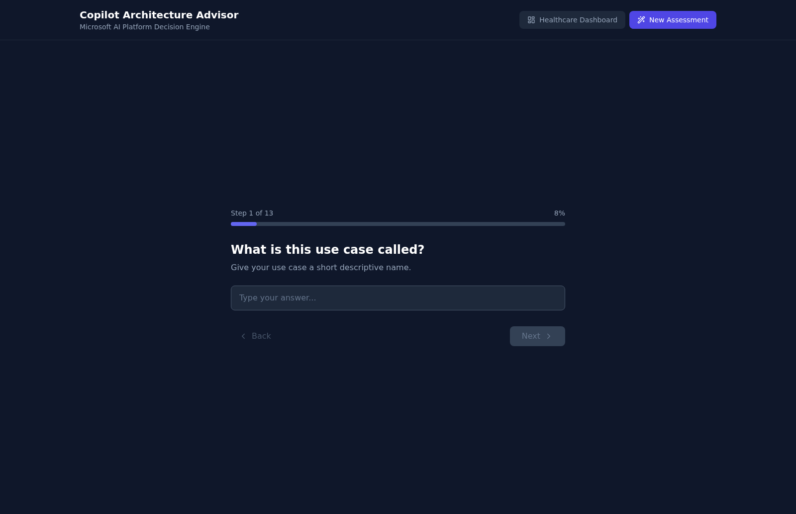

# Copilot Architecture Advisor

A decision engine that recommends the optimal Microsoft AI platform architecture (Copilot Studio, Agent Builder, Fabric Agent, or Azure AI Foundry) based on a 13-question assessment wizard. Built for Microsoft Healthcare AI teams.

## Screenshots

### Healthcare Dashboard — 50 Pre-Built Use Cases


### Use Case Detail — Functional Spec + Architecture Diagram


### Architecture Diagram — Scoring, Flow, Decision Signals


### 13-Question Wizard — New Assessment


## Features

### Phase 1 — Core Wizard + Scoring Engine
- **13-Question Wizard**: Guided assessment covering complexity, data sources, PHI/compliance, UX channel, team capability, agent behavior, custom models, and human-in-loop requirements
- **Deterministic Scoring Engine**: Rule-based WEIGHT_MATRIX with PHI hard-cap enforcement and custom model constraints
- **50 Healthcare Use Cases Dashboard**: Pre-built healthcare provider scenarios across 5 categories with full architecture recommendations and drill-down views
- **Functional Spec Generation**: Auto-generated implementation specifications for each recommendation
- **Architecture Diagrams**: Rich SVG architecture flow diagrams with gradient bars, decision signal cards, and Azure service pills
- **SQLite Persistence**: All assessments saved for historical review

### Phase 2 — RAG + ChromaDB Knowledge Base
- **ChromaDB Vector Store**: Local embeddings with all-MiniLM-L6-v2 SentenceTransformer (no Azure quota needed)
- **Guidance Sync Agent**: Crawls Microsoft Learn docs, chunks, embeds, and classifies into ChromaDB
- **Nightly Sync**: APScheduler cron job at 06:00 UTC for automatic document updates
- **RAG Augmentation**: Scoring engine augmented with at most ONE high-confidence chunk adjustment per run
- **PHI Hard-Cap**: RAG can NEVER override PHI enforcement — only boost FOUNDRY_AGENT in PHI cases
- **Citations**: Retrieved chunks displayed as citations alongside recommendations

### Phase 3 — Azure AI Foundry Integration
- **Foundry Agent (greg v1)**: Enhanced spec narrative when scoring confidence < 0.70
- **SSE Streaming**: POST /api/recommend/enhanced uses fetch + ReadableStream for real-time status updates
- **8-Second Timeout**: Rule-based spec always shown on Foundry timeout — never blank screen
- **Entra ID Auth**: /api/recommend/enhanced and /api/guidance/ask require Entra ID authentication
- **Guidance Q&A**: Natural language questions answered via Foundry + ChromaDB context

### Phase 4 — Admin Dashboard + Feedback
- **Feedback Endpoint**: POST /api/feedback for accuracy tracking per session
- **Admin Stats**: Accuracy by architecture, feedback summary, sync status, ChromaDB doc count
- **Sync History**: Full guidance sync log with success/failure tracking

## Architecture

```
frontend/                React 18 + Vite + TypeScript + Tailwind CSS
backend/
  app/
    scoring/             Scoring engine, weight matrix, RAG augmentation, validation contracts
    spec/                Functional spec JSON builder
    knowledge/           SQLite store, ChromaDB store, 50 healthcare use cases
    agents/              Foundry client (greg v1), guidance sync crawler
    auth.py              Entra ID authentication middleware
data/                    SQLite database (auto-created)
docker-compose.yml       ChromaDB + Backend + Frontend with health dependencies
```

## Four Competing Architectures

| ID | Label | Best For |
|---|---|---|
| COPILOT_STUDIO | Microsoft Copilot Studio | Low-code Teams bots, simple Q&A |
| AGENT_BUILDER | Microsoft 365 Copilot Agent Builder | M365-native declarative agents |
| FABRIC_AGENT | Microsoft Fabric Agent | Data-heavy analytics with Fabric/Snowflake |
| FOUNDRY_AGENT | Microsoft Copilot + Azure AI Foundry | PHI/HIPAA, custom models, complex orchestration |

## Local Development

### Prerequisites

- Python 3.12+
- Node.js 20+
- Poetry (`pip install poetry`)
- Azure CLI (`az login` for Foundry integration — optional)

### Backend

```bash
cd backend
poetry install
poetry run uvicorn app.main:app --host 0.0.0.0 --port 8000 --reload
```

### Frontend

```bash
cd frontend
npm install
npm run dev
```

The frontend runs on `http://localhost:5173` by default and proxies API calls to `http://localhost:8000`.

Set `VITE_API_URL` environment variable to override the backend URL.

### Docker Compose (Full Stack)

```bash
docker compose up --build
```

Services:
- **ChromaDB**: http://localhost:8100 (healthcheck: `/api/v1/heartbeat`)
- **Backend**: http://localhost:8000 (depends on ChromaDB healthy)
- **Frontend**: http://localhost:3000 (depends on Backend healthy)

### First Run

1. Start the stack: `docker compose up --build`
2. ChromaDB initializes with persistent volume
3. Backend creates SQLite tables and seeds 50 healthcare use cases
4. Trigger initial guidance sync: `curl -X POST http://localhost:8000/api/guidance/sync`
5. Open http://localhost:3000 to access the dashboard

## API Endpoints

| Method | Path | Auth | Description |
|---|---|---|---|
| GET | `/healthz` | None | Health check |
| GET | `/api/health` | None | API health with ChromaDB count + Foundry status |
| POST | `/api/recommend` | None | Rule-based scoring with RAG augmentation |
| POST | `/api/recommend/enhanced` | Entra ID | SSE streaming with Foundry agent for low-confidence cases |
| GET | `/api/cases` | None | List saved use cases (paginated) |
| GET | `/api/healthcare-cases` | None | Get 50 pre-scored healthcare use cases |
| POST | `/api/guidance/sync` | None | Trigger manual guidance sync |
| GET | `/api/guidance/status` | None | Last sync time + doc count |
| GET | `/api/guidance/sources` | None | List configured seed sources |
| POST | `/api/guidance/add-document` | None | Add custom document URL to knowledge base |
| POST | `/api/guidance/ask` | Entra ID | Natural language Q&A via Foundry + ChromaDB |
| POST | `/api/tools/search_guidance` | None | Tool endpoint for Foundry agent |
| POST | `/api/feedback` | None | Submit accuracy feedback |
| GET | `/api/admin/stats` | None | Admin dashboard stats |
| GET | `/api/admin/guidance-documents` | None | List guidance documents (paginated) |
| GET | `/api/admin/sync-history` | None | Guidance sync history |

## Healthcare Dashboard Categories

1. **Clinical Operations** (hc-001 to hc-010) — Triage, medication, clinical documentation
2. **Revenue Cycle** (hc-011 to hc-020) — Billing, claims, prior authorization
3. **Patient Engagement** (hc-021 to hc-030) — Portals, scheduling, health literacy
4. **Compliance & Quality** (hc-031 to hc-040) — HIPAA, quality measures, audit
5. **Operations & Workforce** (hc-041 to hc-050) — Staffing, supply chain, credentialing

## Test Results — 340/340 (100% Pass Rate)

17 acceptance test cases x 20 runs each = 340 total tests:

| Test Case | Expected | 20/20 |
|---|---|---|
| TC1: PHI + complex | FOUNDRY_AGENT | PASS |
| TC2: Simple Teams low-code | COPILOT_STUDIO | PASS |
| TC3: M365 Copilot declarative | AGENT_BUILDER | PASS |
| TC4: Fabric analytics | FABRIC_AGENT | PASS |
| TC5: Multi-agent complex | FOUNDRY_AGENT | PASS |
| TC6: PHI + simple | FOUNDRY_AGENT | PASS |
| TC7: Moderate web mixed | FOUNDRY_AGENT | PASS |
| TC8: Enterprise API procode | FOUNDRY_AGENT | PASS |
| TC9: Moderate Teams mixed | COPILOT_STUDIO | PASS |
| TC10: Simple M365 lowcode | AGENT_BUILDER | PASS |
| TC11: Autonomous agent | FOUNDRY_AGENT | PASS |
| TC12: Fine-tuned model | FOUNDRY_AGENT | PASS |
| TC13: BYOM | FOUNDRY_AGENT | PASS |
| TC14: Multi-agent + escalation | FOUNDRY_AGENT | PASS |
| TC15: Guided Teams + approval | COPILOT_STUDIO | PASS |
| TC16: High confidence (>=0.70) | COPILOT_STUDIO | PASS |
| TC17: Low confidence (<0.70) | FOUNDRY_AGENT | PASS |

## Environment Variables

| Variable | Default | Description |
|---|---|---|
| `DATABASE_PATH` | `/data/advisor.db` | SQLite database file path |
| `VITE_API_URL` | `http://localhost:8000` | Backend API URL (frontend build-time) |
| `CHROMA_HOST` | `chromadb` | ChromaDB hostname |
| `CHROMA_PORT` | `8000` | ChromaDB port |
| `AUTH_DEV_MODE` | `true` | Skip Entra ID auth in development |
| `AZURE_FOUNDRY_ENDPOINT` | — | Azure AI Foundry project endpoint |
| `AZURE_FOUNDRY_AGENT_NAME` | `greg` | Foundry agent name |
| `AZURE_FOUNDRY_AGENT_VERSION` | `1` | Foundry agent version |
